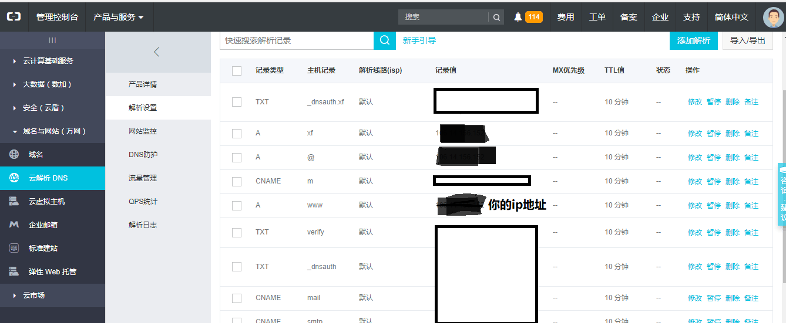
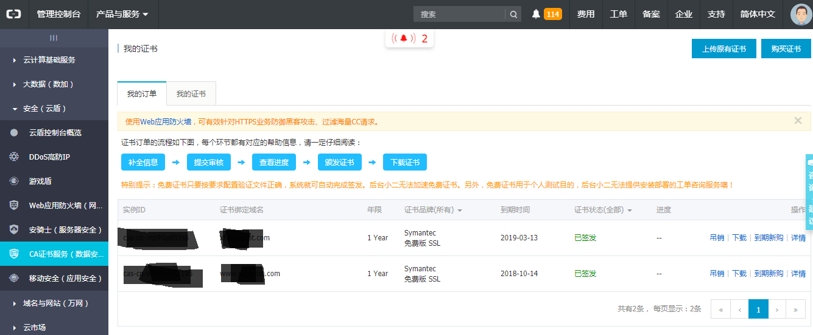
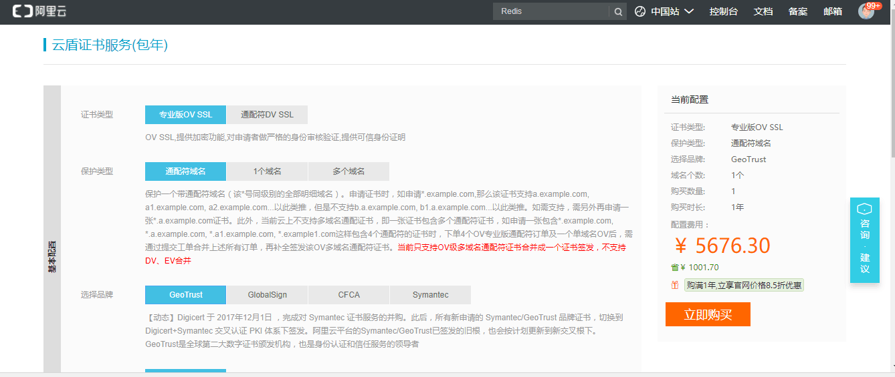
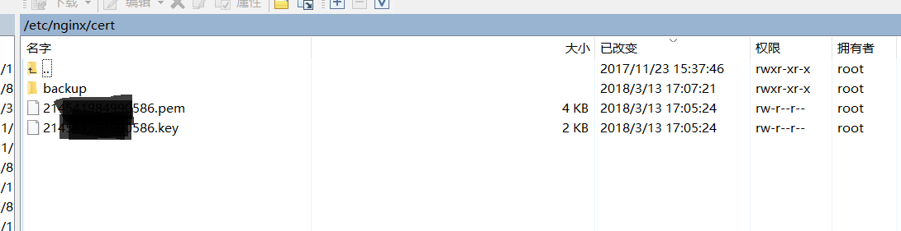
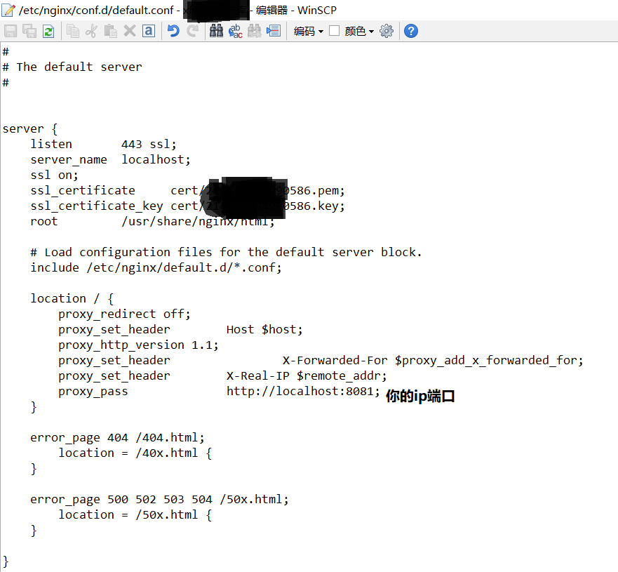
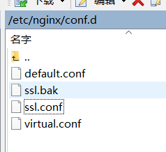
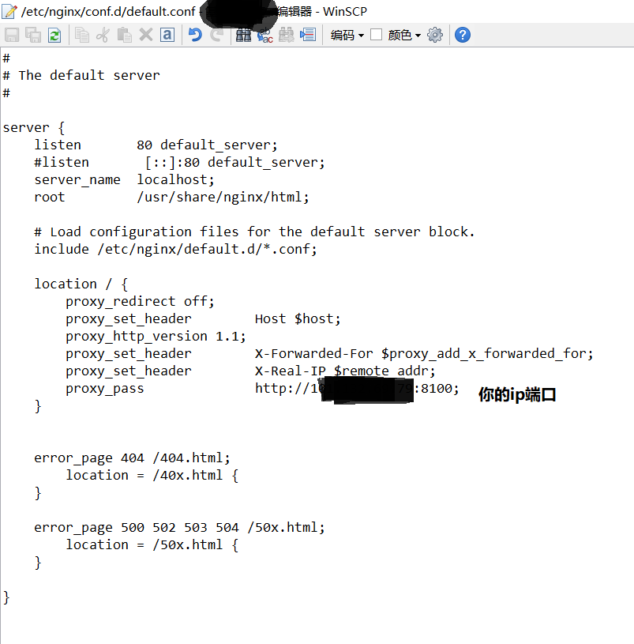
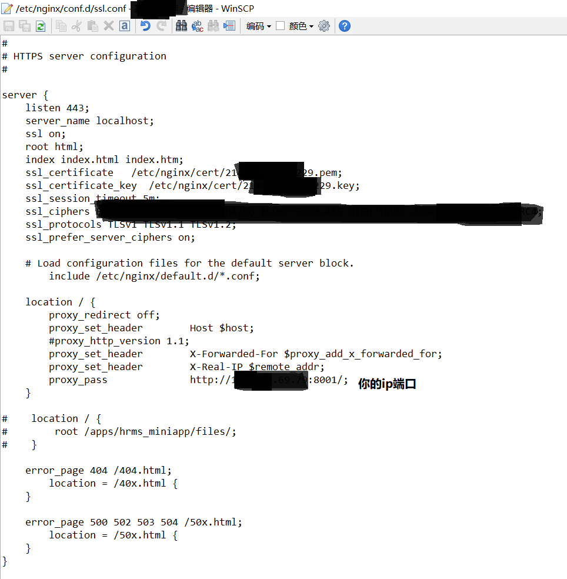

## 配置解析域名及对应的ip地址

设置好域名和对应的ip服务器地址

## 购买配置证书

选择symantec一个域名免费型

购买后 填写申请人信息 选择dns（dns和文件二选一） 
申请成功后下载nginx证书（zip里包含xx.pem和xx.key两个文件）
把这两个文件放入域名对应的ip服务器的nginx目录下

在nginx的conf文件里配置https默认端口443对应的tomcat端口

## nginx相关配置

也可以在default.conf里配置http（默认80端口）对应的tomcat，在ssl.conf里配置https（默认443端口）对应的tomcat

