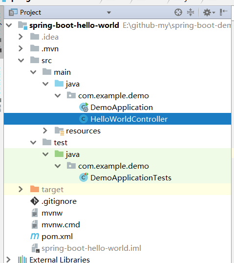
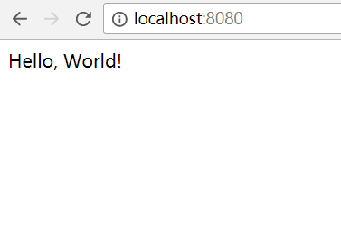

## 项目创建

1. 使用idea开发，[下载地址](https://www.jetbrains.com/idea/)
2. 打开idea，点击New Project
3. 选择Spring Initializr,点击Next
4. 填写Group、Artifact,点击Next
5. 选择Web,勾选Web,点击Next
6. 选择项目路径,点击Finish

## 创建Controller

在DemoApplication同级下创建HelloWorldController

```java
package com.example.demo;

import org.springframework.web.bind.annotation.RequestMapping;
import org.springframework.web.bind.annotation.RestController;

@RestController
public class HelloWorldController {

    @RequestMapping("/")
    public String helloWorld() {
        return "Hello, World!";
    }
}
```

## 目录结构



## 启动

1. 使用run或者debug启动项目
2. 默认是8080 (http)端口
3. 访问 http://localhost:8080/ 看到效果



## 总结 

[该项目在github地址](https://github.com/chenyuanchn/spring-boot-demo)

## 待续
